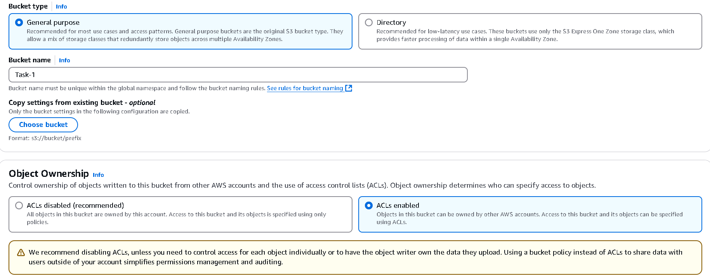
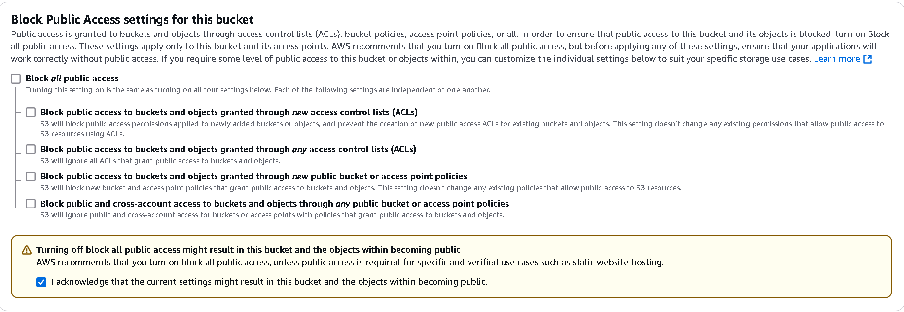
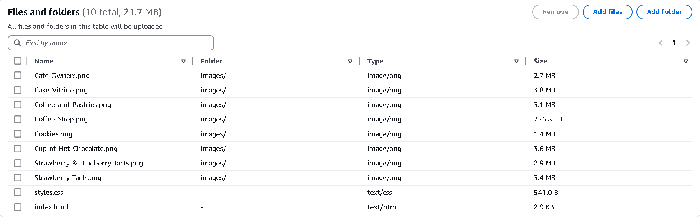
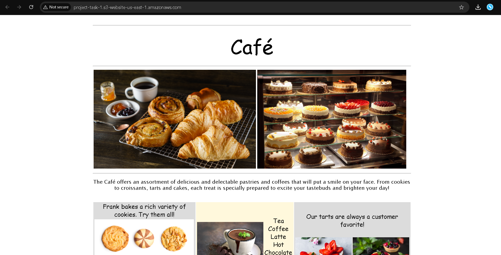

# Cloud_Storage_Setup

**COMPANY**: CODTECH IT SOLUTIONS 

**NAME**: M.S.G.N. SURYA VAIBHAV

**INTERN ID**: CT08IVH

**DOMAIN**: CLOUD COMPUTING

**BATCH DURATION**: JANUARY 20, 2025 to FEBRURAY 20, 2025

**MENTOR NAME**: NEELA SANTOSH

## DESCRIPTION
### Amazon S3

Amazon Simple Storage Service (Amazon S3) is an object storage service that offers industry-leading scalability, data availability, security, and performance. For a variety of use scenarios, including data lakes, websites, mobile applications, backup and restore, archiving, corporate applications, Internet of Things devices, and big data analytics, users of all sizes and sectors can use Amazon S3 to store and safeguard any volume of data.

### Task:
1. CREATE AND CONFIGURE CLOUD
STORAGE ON AWS S3 OR GOOGLE
CLOUD STORAGE.

2. DELIVERABLE: A BUCKET SETUP WITH
EXAMPLE FILES UPLOADED AND
ACCESS PERMISSIONS CONFIGURED.

### procedure:
1.Creating an S3 bucket :
  - Firstly we need to create an S3 bucket
  - We need to select the purpose of the bucket (Genral purpose)
  - We need to give an name to the bucket. (Task-1)
  >[!NOTE]
  >The name of the bucket should be within the global namespace
  - Enable Acls
      - By this the objects in the bucket can be owned by other AWS accounts. Access to the bucket and its objects can be specified using ACLs.
    
  - Turn off block all the public access
      - This will make the object or the bucket public accessble
      - Click the checkbox of warning
    

  - You can turn on the bucket versioning for the versions of your files (optional). 
  - Create the bucket with these settings.
  - Access the bucket.
  - Get into the propertys tab and scroll down and click on the host static website.    
    1. Select on the enable.
    2. Select the host a static website.
    3. Give the index document of your website or file.
    4. Save the changes.
  - Upload your files to your s3 bucket
    

  - Navigate to the permissions
  - Edit the [Bucket policy](permission.JSON)
  - You can write an json code or you can also genrate an code using aws policy genrator.
  - Policy genrator is an tools which uses GUI and give you the json code for those permission accrodingly
  - Go to Static website hosting and there would be an Bucket website endpoint access that end point to get to your website which you have hosted
### Output:

